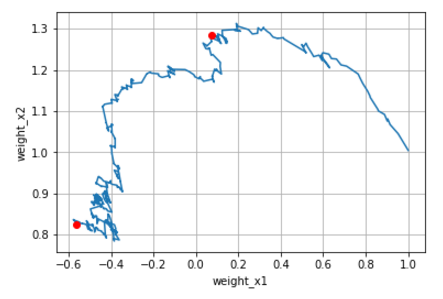

# Playing with stochastic gradient descent

The following notebooks of gradual difficulty are available.

### [two_points_sgd.ipynb](two_points_sgd.ipynb)

Fit a line through 2 points using stochastic gradient descent.

### [regression_sgd.ipynb](regression_sgd.ipynb)

Perform regression using stochastic gradient descent.

Weights search

### [classification_sgd.ipynb](classification_sgd.ipynb)

Perform classification using a single layer perceptron.

Weights search

