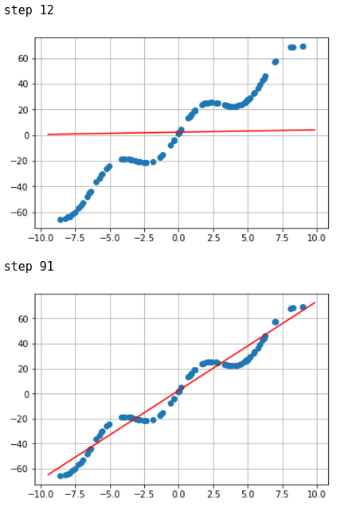
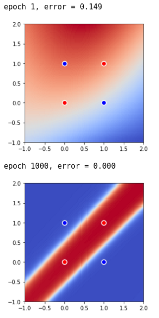
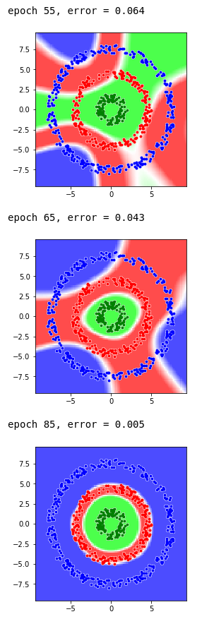

# Playing with gradient descent

A collection of notebooks leveraging gradient descent to fit a variety of simple datasets. From scratch, for fun.

**Note**: Some of the notebooks use a homemade implementation of a multilayer perceptron (in [lib/mlp.py](lib/mlp.py)). The online book [Neural Networks and Deep Learning](http://neuralnetworksanddeeplearning.com/) has been of tremendous help to unravel the equations of the backpropagation algorithm.

## Notebooks

The following notebooks of increasing difficulty are available.

### [two_points_sgd.ipynb](two_points_sgd.ipynb)

Fit a line through 2 points using stochastic gradient descent.

### [regression_sgd.ipynb](regression_sgd.ipynb)

Perform regression using stochastic gradient descent.

Weights search

### [classification_sgd.ipynb](classification_sgd.ipynb)

Perform classification using a single layer perceptron.

Weights search

### [xor_mlp.ipynb](xor_mlp.ipynb)

Separate the XOR problem using a multilayer perceptron.

### [three_donuts_mlp.ipynb](three_donuts_mlp.ipynb) and [six_donuts_mlp.ipynb](six_donuts_mlp.ipynb)

Separate donuts using a multilayer perceptron.

##### Three donuts

##### Six donuts

### [mnist_mlp.ipynb](mnist_mlp.ipynb)

Recognize handwritten digits using a multilayer perceptron with 97.5% accuracy.

Using [MNIST](http://yann.lecun.com/exdb/mnist/) dataset.

##### Correct predictions that were the most certain for each class

##### Correct predictions that were the least certain

##### Incorrect predictions that were the most certain

##### Incorrect predictions that were the least certain

## Installation notes

The required python packages to install to run the notebooks are listed in `requirements.txt`.

If you want to run the cells using [Keras](https://keras.io/), make sure to [configure its backend](https://keras.io/backend/) appropriately.
